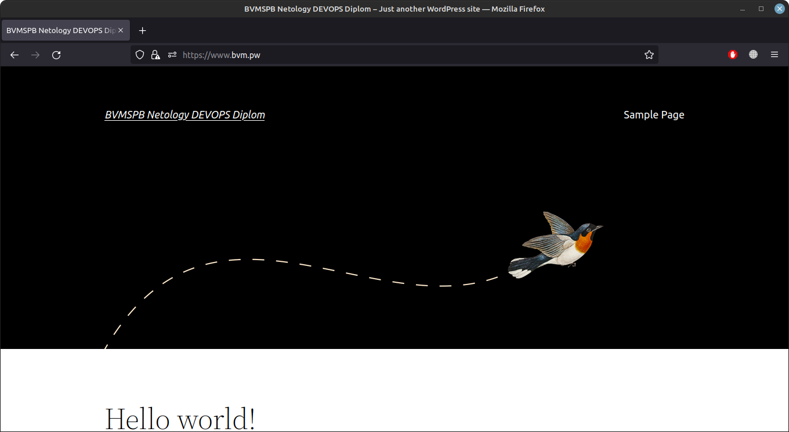
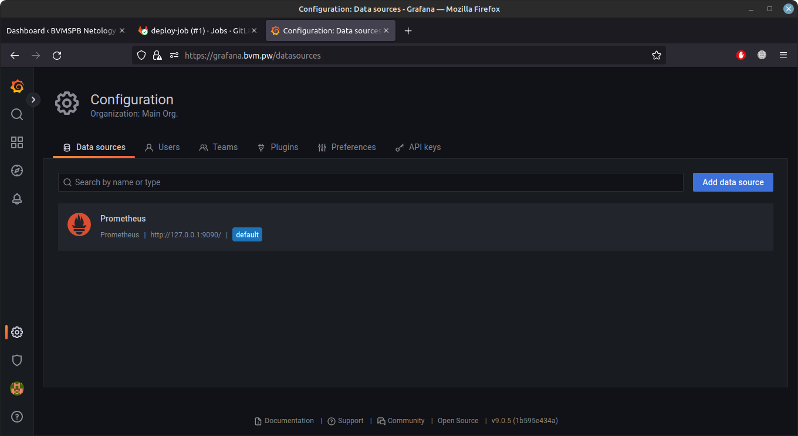

Для работы с YC необходимо задать переменные окружения с чувствительной информацией:

```bash
export TF_VAR_yc_token=AQxxx_MySecretOAuthToken_here
export TF_VAR_yc_cloud_id=b1gfYC_Cloud_Id_Here
export TF_VAR_yc_folder_id=b1gd8xxxxxxxxxxx
export AWS_ACCESS_KEY_ID=YCAJExxxxxxxxxx
export AWS_SECRET_ACCESS_KEY=YCPZIxxxxxxxx
export ANSIBLE_HOST_KEY_CHECKING=False
```

Для работы с terraform из России также необходимо настроить работу с зеркалом в Яндекс:

```bash
cat ~/.terraformrc 
provider_installation {
 network_mirror {
   url = "https://terraform-mirror.yandexcloud.net/"
   include = ["registry.terraform.io/*/*"]
 }
 direct {
   exclude = ["registry.terraform.io/*/*"]
 }
}

```

Подробности заданий и мои комментарии по мере их выполнения - в [документе](https://github.com/bvmspb/diplom_devops/blob/main/diplom_devops.md)

Далее перечислены шаги и иллюстрации запуска и работы стенда.

# 1 Клонируем репозиторий

```bash
git clone git@github.com:bvmspb/diplom_devops.git
```

# 2 Переходим в директорию terraform клонированного репозитория и запускаем:

```bash
terraform init
terraform workspace new stage
```

# 3 Запускаем terraform на создание инфраструктуры и подготовки ansible playbook'ов для стенда:

```bash
time terraform apply --auto-approve
```

# 4 После окончания запуска всех ВМ и инициализации всех служб переходим к проверке работы всех сервисов

[Диплом 01. Сайт Wordpress](https://github.com/bvmspb/diplom_devops/blob/main/images/Diplom_final_1.png): 

[Диплом 02. Сайт Wordpress, авторизация в Wordpress](https://github.com/bvmspb/diplom_devops/blob/main/images/Diplom_final_2.png): 

[Диплом 03. Сайт Wordpress, backoffice](https://github.com/bvmspb/diplom_devops/blob/main/images/Diplom_final_3.png): 

[Диплом 04. Gitlab, авторизация](https://github.com/bvmspb/diplom_devops/blob/main/images/Diplom_final_4.png): 

[Диплом 05. Gitlab, создание вручную нового репозитория](https://github.com/bvmspb/diplom_devops/blob/main/images/Diplom_final_5.png): 

[Диплом 06. Gitlab, простая демонстрация возможности автоматизированного ci/cd для деплоя при создании нового тега](https://github.com/bvmspb/diplom_devops/blob/main/images/Diplom_final_6.png): 

[Диплом 07. Gitlab, создание тега](https://github.com/bvmspb/diplom_devops/blob/main/images/Diplom_final_7.png): 

[Диплом 08. Gitlab, результат Job, автоматически отработавшей при создании тега](https://github.com/bvmspb/diplom_devops/blob/main/images/Diplom_final_8.png): 

[Диплом 09. Gitlab, Протокол работы Job, автоматически отработавшей при создании тега](https://github.com/bvmspb/diplom_devops/blob/main/images/Diplom_final_9.png): 

[Диплом 10. Gitlab, виден новый файл, переданный на сервер приложения](https://github.com/bvmspb/diplom_devops/blob/main/images/Diplom_final_10.png): 

[Диплом 11. Grafana, настроенный источник данных из Prometheus](https://github.com/bvmspb/diplom_devops/blob/main/images/Diplom_final_11.png): 

[Диплом 12. Grafana, работа dashboard'а для всех node_exporter'ов](https://github.com/bvmspb/diplom_devops/blob/main/images/Diplom_final_12.png): 

[Диплом 13. Prometheus, статус всех подключенных источников данных-таргетов](https://github.com/bvmspb/diplom_devops/blob/main/images/Diplom_final_13.png): 

[Диплом 14. Prometheus, видно наличие большого числа алертов](https://github.com/bvmspb/diplom_devops/blob/main/images/Diplom_final_14.png): 

[Диплом 15. Prometheus, список алертов, отфильтрован только по сработавшим](https://github.com/bvmspb/diplom_devops/blob/main/images/Diplom_final_15.png): 

[Диплом 16. Alertmanager, список сработавших алертов](https://github.com/bvmspb/diplom_devops/blob/main/images/Diplom_final_16.png): 

[Диплом 17. Alertmanager, текущий статус и версия](https://github.com/bvmspb/diplom_devops/blob/main/images/Diplom_final_17.png): 

[Диплом 18. DNS-записи для домена bvm.pw](https://github.com/bvmspb/diplom_devops/blob/main/images/Diplom_final_18.png): 

[Диплом 19. YC-консоль](https://github.com/bvmspb/diplom_devops/blob/main/images/Diplom_final_19.png): 

[Диплом 20. YC-консоль, список запущенных ВМ](https://github.com/bvmspb/diplom_devops/blob/main/images/Diplom_final_20.png): 

[Диплом 21. Конечный результат запуска команды terraform apply](https://github.com/bvmspb/diplom_devops/blob/main/images/Diplom_final_21.png): 

[Диплом 22. Конечный результат запуска команды terraform destroy](https://github.com/bvmspb/diplom_devops/blob/main/images/Diplom_final_22.png): 

[Диплом 23. YC-консоль, после запуска команды terraform destroy](https://github.com/bvmspb/diplom_devops/blob/main/images/Diplom_final_23.png): 

# 5 выполнить команду, для выключения и удаления всей инфраструктуры

```bash
time terraform destroy --auto-approve
```