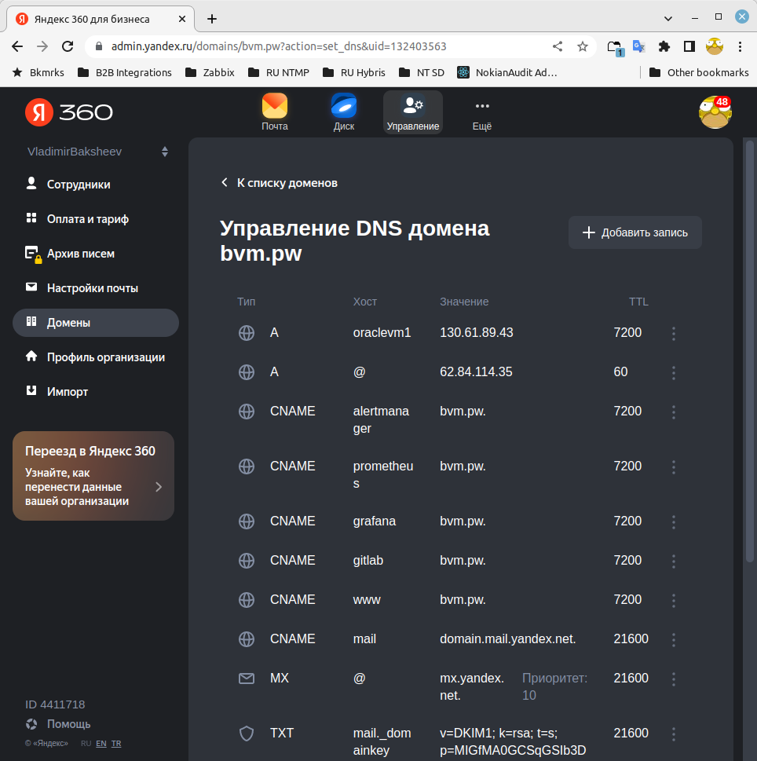

# devops-netology DEVSYS-PDC-2

### DEVSYS-PDC-2 Diplom Vladimir Baksheev / Владимир Бакшеев Дипломное задание по курсу «DevOps-инженер»

Задание

Преподаватель: Булат Замилов, Олег Букатчук, Руслан Жданов
Дипломный практикум в YandexCloud

Цели:

- Зарегистрировать доменное имя (любое на ваш выбор в любой доменной зоне).
- Подготовить инфраструктуру с помощью Terraform на базе облачного провайдера YandexCloud.
- Настроить внешний Reverse Proxy на основе Nginx и LetsEncrypt.
- Настроить кластер MySQL.
- Установить WordPress.
- Развернуть Gitlab CE и Gitlab Runner.
- Настроить CI/CD для автоматического развёртывания приложения.
- Настроить мониторинг инфраструктуры с помощью стека: Prometheus, Alert Manager и Grafana.

Этапы выполнения:

# 1. Регистрация доменного имени

Подойдет любое доменное имя на ваш выбор в любой доменной зоне.
ПРИМЕЧАНИЕ: Далее в качестве примера используется домен you.domain замените его вашим доменом.
Рекомендуемые регистраторы:

* nic.ru
* reg.ru

Цель:

Получить возможность выписывать TLS сертификаты для веб-сервера.
Ожидаемые результаты:

У вас есть доступ к личному кабинету на сайте регистратора.
Вы зарегистрировали домен и можете им управлять (редактировать dns записи в рамках этого домена).

[bvm.pw DNS записи, доступен для управления](https://github.com/bvmspb/diplom_devops/blob/main/images/diplom_bvm.pw_dns_records1.png): 

# 2. Создание инфраструктуры

Для начала необходимо подготовить инфраструктуру в YC при помощи Terraform.

```answer2-1
    Переиспользую созданный ранее token и cloud id в YC - использовались при 
    работе над ДЗ по terraform.
    
    Все подобные приватные данные, необходимые terraform для работы, передаю 
    через переменные окружения, а не в файлах непосредственно.
```
```bash
export TF_VAR_yc_token=AQxxx_MySecretOAuthToken_here
export TF_VAR_yc_cloud_id=b1gfYC_Cloud_Id_Here
export TF_VAR_yc_folder_id=b1gd8xxxxxxxxxxx
export AWS_ACCESS_KEY_ID=YCAJExxxxxxxxxx
export AWS_SECRET_ACCESS_KEY=YCPZIxxxxxxxx
export ANSIBLE_HOST_KEY_CHECKING=False
```

Особенности выполнения:

Бюджет купона ограничен, что следует иметь в виду при проектировании инфраструктуры и использовании ресурсов;
Следует использовать последнюю стабильную версию Terraform.
Предварительная подготовка:

Создайте сервисный аккаунт, который будет в дальнейшем использоваться Terraform для работы с инфраструктурой с необходимыми и достаточными правами. Не стоит использовать права суперпользователя

```bash
bvm@bvm-HP-EliteBook-8470p:~/netology/devops-netology/diplom/terraform$ yc iam service-account create --name ycsa --description "service account to folder b1gd8xxxxx"
id: ajem0ixxxxxxx
folder_id: b1gd8xxxxx
created_at: "2022-07-14T16:36:24.854735997Z"
name: ycsa
description: service account to folder b1gd8xxxxx

bvm@bvm-HP-EliteBook-8470p:~/netology/devops-netology/diplom/terraform$ yc resource-manager folder add-access-binding default --role editor --subject serviceAccount:ajem0ixxxxxxx
done (1s)
bvm@bvm-HP-EliteBook-8470p:~/netology/devops-netology/diplom/terraform$ yc iam key create --service-account-name ycsa --output key.json
id: ajelkxxxxxxxxx
service_account_id: ajem0ixxxxxxx
created_at: "2022-07-14T16:40:22.473896944Z"
key_algorithm: RSA_2048

```

Подготовьте backend для Terraform:
а. Рекомендуемый вариант: Terraform Cloud
б. Альтернативный вариант: S3 bucket в созданном YC аккаунте.

```answer2-2
    Использую приватный бакет netology-bvmspb в YC, описание вынесено 
    в versions.tf, авторизация при помощи статичного ключа созданного
    для сервисного аккаунта
```
```bash
bvm@bvm-HP-EliteBook-8470p:~/netology/diplom_devops/terraform$ yc iam access-key create --service-account-name ycsa --description "this key is for my bucket"
access_key:
  id: aje7axxxxxxxxx
  service_account_id: ajem0ixxxxxxx
  created_at: "2022-07-14T19:23:49.965134914Z"
  description: this key is for my bucket
  key_id: YCAJExxxxxxxx
secret: YCPZIxxxxxxxx
```

Настройте workspaces
а. Рекомендуемый вариант: создайте два workspace: stage и prod. В случае выбора этого варианта все последующие шаги должны учитывать факт существования нескольких workspace.
б. Альтернативный вариант: используйте один workspace, назвав его stage. Пожалуйста, не используйте workspace, создаваемый Terraform-ом по-умолчанию (default).

```answer2-3
    bvm@bvm-HP-EliteBook-8470p:~/netology/diplom_devops/terraform$ terraform workspace new prod
    Created and switched to workspace "prod"!
    
    You're now on a new, empty workspace. Workspaces isolate their state,
    so if you run "terraform plan" Terraform will not see any existing state
    for this configuration.
    bvm@bvm-HP-EliteBook-8470p:~/netology/diplom_devops/terraform$ terraform workspace new stage
    Created and switched to workspace "stage"!
    
    You're now on a new, empty workspace. Workspaces isolate their state,
    so if you run "terraform plan" Terraform will not see any existing state
    for this configuration.

```

Создайте VPC с подсетями в разных зонах доступности.

```answer2-4
    Переиспользую параметры из созданных ранее сети default 
    и ее подсетей default-ru-central1-a и default-ru-central1-b
```

Убедитесь, что теперь вы можете выполнить команды terraform destroy и terraform apply без дополнительных ручных действий.
В случае использования Terraform Cloud в качестве backend убедитесь, что применение изменений успешно проходит, используя web-интерфейс Terraform cloud.

```answer2-5
    Да, VPC ресурсы успешно создаются при apply и удаляются после destroy: 
        yandex_vpc_subnet.default-ru-central1-a: Destroying... [id=e9bnea6o671a00lcc2i3]
        yandex_vpc_subnet.default-ru-central1-b: Destroying... [id=e9bfh3bvcj90e292tgve]
        yandex_vpc_subnet.default-ru-central1-b: Destruction complete after 5s
        yandex_vpc_subnet.default-ru-central1-a: Destruction complete after 6s
        yandex_vpc_network.default: Destroying... [id=enpvdvjptf12ddtdact4]
        yandex_vpc_network.default: Destruction complete after 0s
        
        Destroy complete! Resources: 3 destroyed.
```

Цель:

Повсеместно применять IaaC подход при организации (эксплуатации) инфраструктуры.
Иметь возможность быстро создавать (а также удалять) виртуальные машины и сети. С целью экономии денег на вашем аккаунте в YandexCloud.
Ожидаемые результаты:

Terraform сконфигурирован и создание инфраструктуры посредством Terraform возможно без дополнительных ручных действий.
Полученная конфигурация инфраструктуры является предварительной, поэтому в ходе дальнейшего выполнения задания возможны изменения.

# 3. Установка Nginx и LetsEncrypt

Необходимо разработать Ansible роль для установки Nginx и LetsEncrypt.
Для получения LetsEncrypt сертификатов во время тестов своего кода пользуйтесь тестовыми сертификатами, так как количество запросов к боевым серверам LetsEncrypt лимитировано.

Рекомендации:

* Имя сервера: you.domain
* Характеристики: 2vCPU, 2 RAM, External address (Public) и Internal address.

Цель:

Создать reverse proxy с поддержкой TLS для обеспечения безопасного доступа к веб-сервисам по HTTPS.
Ожидаемые результаты:

В вашей доменной зоне настроены все A-записи на внешний адрес этого сервера:

- https://www.you.domain (WordPress)
- https://gitlab.you.domain (Gitlab)
- https://grafana.you.domain (Grafana)
- https://prometheus.you.domain (Prometheus)
- https://alertmanager.you.domain (Alert Manager)

Настроены все upstream для вышеуказанных URL, куда они сейчас ведут на этом шаге не важно, позже вы их отредактируете и укажете верные значения.
В браузере можно открыть любой из этих URL и увидеть ответ сервера (502 Bad Gateway). На текущем этапе выполнение задания это нормально!

```answer3
Очень много времени потратил на то, чтобы разобраться с тем, как управлять 
dns-записями для моего домена - динамический ip-адрес создаваемых ВМ 
каждый раз меняется. Переносить управление DNS в YC не стал так как не было 
живого примера, а также делегирование управления DNS для меня могло не 
сработать (я регистрировал домен еще до начала известных событий и 
полноценное управление им для меня сейчас под вопросом или затруднено) - в 
конечном итоге пошел по более простому пути - зарезирвировал один из 
внешних ip-адресов в YC как статический и прописал его в настройках 
создаваемого сервера с Nginx. Вынес это в переменную для удобства 
управления в будущем.
 
Также понял, что YC находится еще только в своей ранней стадии развития 
потому, что в документации нет описания всех допустимых параметров, не 
говоря уже о наличии примеров для всех инструментов - и для консоли, и для 
CLI, и для Terraform. Мне лично помогло найти требуемый параметр для ресурса 
compute instance (nat_ip_address) только когда заглянул непосредственно в 
код провайдера, где были описаны все возможные варианты.

Самым быстрым способом организовать автоматическое получения SSL сертификата 
для всех под-доменов оказалось установить certbot непосредственно по 
инструкции от Let's Encrypt.
Привожу скриншот обновленных настроек DNS записей и проверку сертификата 
(в "боевом режиме", а не в тестовом)
```

[bvm.pw DNS записи, добавлены под-домены](https://github.com/bvmspb/diplom_devops/blob/main/images/diplom_bvm.pw_dns_records2.png): 

[bvm.pw SSL certificate](https://github.com/bvmspb/diplom_devops/blob/main/images/diplom_bvm.pw_ssl_cert_prod.png): 


4. Установка кластера MySQL

Необходимо разработать Ansible роль для установки кластера MySQL.

Рекомендации:

• Имена серверов: db01.you.domain и db02.you.domain
• Характеристики: 4vCPU, 4 RAM, Internal address.

Цель:

Получить отказоустойчивый кластер баз данных MySQL.
Ожидаемые результаты:

MySQL работает в режиме репликации Master/Slave.
В кластере автоматически создаётся база данных c именем wordpress.
В кластере автоматически создаётся пользователь wordpress с полными правами на базу wordpress и паролем wordpress.
Вы должны понимать, что в рамках обучения это допустимые значения, но в боевой среде использование подобных значений не приемлемо! Считается хорошей практикой использовать логины и пароли повышенного уровня сложности. В которых будут содержаться буквы верхнего и нижнего регистров, цифры, а также специальные символы!

```answer4
Первая проблема, которую нужно было решить - как получить доступ к узлам 
без внешнего ip-адреса - доступны только во внутренней облачной сети, то 
есть нужно прокси с внешним ip-адресом использовать как гейтвей во 
внутреннюю сеть.
Вторая задача - как предоставить доступ в интернет для узлов во 
внутренней облачной сети - это необходимо для установки пакетов через APT. 
Решилось настройкой прокси именно для APT - сделал это общей задачей для 
всех ВМ во внутренней сети.

В качестве основы для роли отвечающей за установку MySQL и настройку 
репликации взял публичную доступную роль Jeff Geerling из 
https://github.com/geerlingguy/ansible-role-mysql 
```
[db01 show master status](https://github.com/bvmspb/diplom_devops/blob/main/images/diplom_mysql_db01_replica_status.png): 

[db02 show replica status](https://github.com/bvmspb/diplom_devops/blob/main/images/diplom_mysql_db02_replica_status.png): 

5. Установка WordPress

Необходимо разработать Ansible роль для установки WordPress.

Рекомендации:

• Имя сервера: app.you.domain
• Характеристики: 4vCPU, 4 RAM, Internal address.

Цель:

Установить WordPress. Это система управления содержимым сайта (CMS) с открытым исходным кодом.
По данным W3techs, WordPress используют 64,7% всех веб-сайтов, которые сделаны на CMS. Это 41,1% всех существующих в мире сайтов. Эту платформу для своих блогов используют The New York Times и Forbes. Такую популярность WordPress получил за удобство интерфейса и большие возможности.

Ожидаемые результаты:

Виртуальная машина на которой установлен WordPress и Nginx/Apache (на ваше усмотрение).
В вашей доменной зоне настроена A-запись на внешний адрес reverse proxy:
https://www.you.domain (WordPress)
На сервере you.domain отредактирован upstream для выше указанного URL и он смотрит на виртуальную машину на которой установлен WordPress.
В браузере можно открыть URL https://www.you.domain и увидеть главную страницу WordPress.
6. Установка Gitlab CE и Gitlab Runner

Необходимо настроить CI/CD систему для автоматического развертывания приложения при изменении кода.

Рекомендации:

• Имена серверов: gitlab.you.domain и runner.you.domain
• Характеристики: 4vCPU, 4 RAM, Internal address.

Цель:

Построить pipeline доставки кода в среду эксплуатации, то есть настроить автоматический деплой на сервер app.you.domain при коммите в репозиторий с WordPress.
Подробнее о Gitlab CI
Ожидаемый результат:

Интерфейс Gitlab доступен по https.
В вашей доменной зоне настроена A-запись на внешний адрес reverse proxy:
https://gitlab.you.domain (Gitlab)
На сервере you.domain отредактирован upstream для выше указанного URL и он смотрит на виртуальную машину на которой установлен Gitlab.
При любом коммите в репозиторий с WordPress и создании тега (например, v1.0.0) происходит деплой на виртуальную машину.
7. Установка Prometheus, Alert Manager, Node Exporter и Grafana

Необходимо разработать Ansible роль для установки Prometheus, Alert Manager и Grafana.

Рекомендации:

• Имя сервера: monitoring.you.domain
• Характеристики: 4vCPU, 4 RAM, Internal address.

Цель:

Получение метрик со всей инфраструктуры.
Ожидаемые результаты:

Интерфейсы Prometheus, Alert Manager и Grafana доступны по https.
В вашей доменной зоне настроены A-записи на внешний адрес reverse proxy:
• https://grafana.you.domain (Grafana)
• https://prometheus.you.domain (Prometheus)
• https://alertmanager.you.domain (Alert Manager)
На сервере you.domain отредактированы upstreams для выше указанных URL и они смотрят на виртуальную машину на которой установлены Prometheus, Alert Manager и Grafana.
На всех серверах установлен Node Exporter и его метрики доступны Prometheus.
У Alert Manager есть необходимый набор правил для создания алертов.
В Grafana есть дашборд отображающий метрики из Node Exporter по всем серверам.
В Grafana есть дашборд отображающий метрики из MySQL (*).
В Grafana есть дашборд отображающий метрики из WordPress (*).
Примечание: дашборды со звёздочкой являются опциональными заданиями повышенной сложности их выполнение желательно, но не обязательно.

Что необходимо для сдачи задания?

Репозиторий со всеми Terraform манифестами и готовность продемонстрировать создание всех ресурсов с нуля.
Репозиторий со всеми Ansible ролями и готовность продемонстрировать установку всех сервисов с нуля.
Скриншоты веб-интерфейсов всех сервисов работающих по HTTPS на вашем доменном имени.
https://www.you.domain (WordPress)
https://gitlab.you.domain (Gitlab)
https://grafana.you.domain (Grafana)
https://prometheus.you.domain (Prometheus)
https://alertmanager.you.domain (Alert Manager)
Все репозитории рекомендуется хранить на одном из ресурсов (github.com или gitlab.com).
